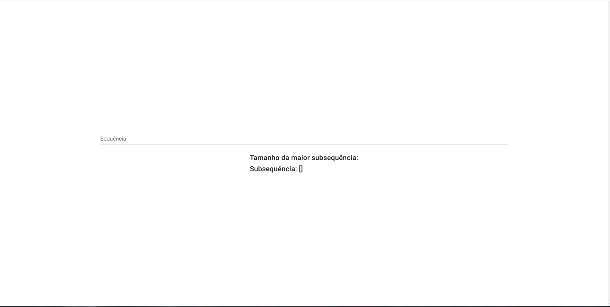
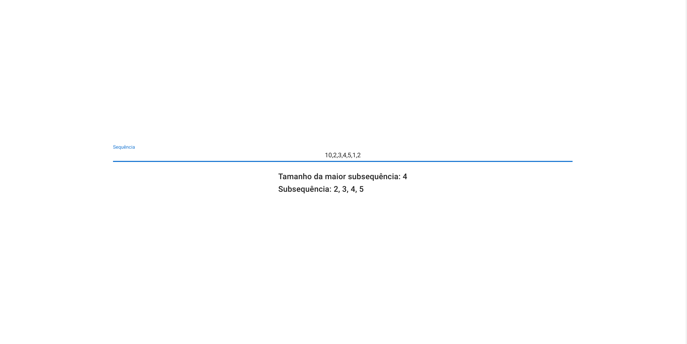
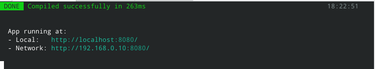

# MSC Renderer

Tema:
 - PD

## Alunos
|Matrícula | Aluno | Github |
| -- | -- | -- |
| 15/0009011 |  Elias Bernardo | @ebmm01 |
| 17/0141161 |  Erick Giffoni | @ErickGiffoni |

## Sobre 
O projeto MSC Renderer tem por objetivo mostrar a maior subsequência crescente de uma sequência de forma fácil e simples através de uma aplicação web. Para isso é utilizado Programação dinâmica.

## Screenshots

## Instalação 

### Requisitos para utilizar esse projeto

- conexão de internet; 
- navegador web de escolha livre (__não usar o safari__); 
- terminal/console/shell no computador; 
- npm; 
- clonar o projeto;

> Para clonar o projeto digite:

    git clone TODO

### Instalando o frontend

Para o front é necessário ter instalado o [node & npm](https://nodejs.org/en/).

Caso você esteja na raiz do projeto vá até a pasta do front-end digitando num terminal:

    cd frontend

E instale as dependências necessárias com o comando:

    npm install

Após a instalação das dependências inicie o projeto:

    npm run serve

Caso tudo ocorra com sucesso você terá uma tela parecida com a abaixo:

## Uso

Antes de usar, faça a [instalação](#Instalação) do projeto.

Você pode assistir o vídeo a seguir para entender como utilizar
o projeto.

- Download na pasta `images/Como usar o projeto .mp4` ou
- Assista pelo YouTube: TODO

1. Abra o navegador web de sua escolha; 
2. Digite na barra de busca o endereço informado pelo frontend (por padrão `http://localhost:8080/` caso você não tenha nenhuma outra aplicação utilizando essa porta);
3. Digite a sequência de números, separados por vírgula;
4. Observe o resultado.

## Problemas ? Sugestões ?

Caso você tenha alguma dificuldade, sugestão ou algum problema com o projeto, 
por favor entre em contato conosco:

- Elias Bernardo - ebmm01@gmail.com - telegram @ebmm01
- Erick Giffoni - giffoni.erick@gmail.com - telegram @ErickGiffoni 
